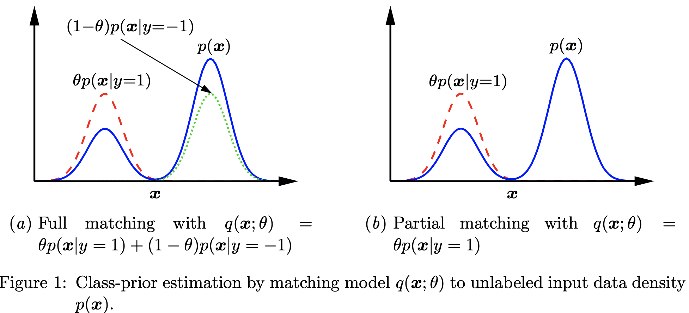

# Class-prior Estimation

+ 20190502, AAAI-18, [Estimating the Class Prior in Positive and Unlabeled Data through Decision Tree Induction](https://www.aaai.org/ocs/index.php/AAAI/AAAI18/paper/download/16776/16539)
    + Assumption: selected completely at random (SCAR).
    + Key insights: SCAR assumption implies that label frequencies in any subdomain are equal. Then the authors split tree data in the decision tree manner and estimate label frequencies in each tree node.

+ 20190505, KDD-08, [Learning Classifiers from Only Positive and Unlabeled Data](http://cseweb.ucsd.edu/~elkan/posonly.pdf)
    + Assumption: selected completely at random (SCAR).
    + Key insights: $f = g / Pr[s = 1 | y = 1] \Rightarrow g \leq Pr[s = 1 | y = 1]$, where $f$ is a traditional classifier while $g$ is a non-traditional classifier. The predictive score from $g$ provides a lower bound for label frequency.

+ 20190505, IEICE Trans. on Info. and Sys. 2014, [Class Prior Estimation from Positive and Unlabeled Data](http://www.ms.k.u-tokyo.ac.jp/2014/ClassPrior2.pdf)
  + Assumption: $Pr[\mathbf{x} | y = 1]$ and $Pr[\mathbf{x} | y = -1]$ do not strongly overlap.
  + Key insights: minimize the Pearson (PE) divergence of $Pr[\mathbf{x}]$ and $Pr[\mathbf{x} | y = 1]$. Also, they show that the estimation of $Pr[y = 1]$ by $\frac{1}{|P|}\displaystyle\sum_{\mathbf{x} \in P}g(\mathbf{x})$ in KDD-08 paper is really doing the same thing as minimizing the PE divergence.
  Here is an illustration of the proposed method 
  + Disadvantage: If the assumption is violated, this method always overestimate the class prior.

+ 20190506, MLJ-17, [Class-prior Estimation for Learning from Positive and Unlabeled Data](https://link.springer.com/content/pdf/10.1007%2Fs10994-016-5604-6.pdf)
  + This is an improved version of IEICE-14 paper.

+ 20190507, ICML-16, [Mixture Proportion Estimation via Kernel Embedding of Distributions](https://arxiv.org/pdf/1603.02501.pdf)
  + Key insights: Cast the class-prior estimation probelm into Mixture Proportion Estimation (MPE) and solve the MPE problem via distribution embedding.
  + Advantages: they derive the convergence rate under some assumptions.
  + Disadvantages: limited scalability due to the use of kernel matrix.

+ 20190514, JMLR-16, [Nonparametric semi-supervised learning of class proportions](https://arxiv.org/pdf/1601.01944.pdf)
  + Key insights: Using kernel density estimation as a tool to connect the mixture distribution and the positive distribution. Then, the likelihood is maximized. They also provide a class-prior preserving transformation method in case of curse-of-dimmensionality.
  + Advantages: They have many theoretical results.
  + Disadvantages: The time complexity is high.

+ 20190514, NIPS-16, [Estimating the class prior and posterior from noisy positives and unlabeled data](https://papers.nips.cc/paper/6168-estimating-the-class-prior-and-posterior-from-noisy-positives-and-unlabeled-data.pdf)
  + Advantages: tackle label noise in positive data; resolve the issue of curse-of-dimmensinality.

# Appendix
+ **Selected Completely At Random (SCAR) assumption**: each positive example has a constant probability $c$ to be selected to be labeled, $c$ is referred to as the label frequency, i.e., $Pr[y = 1 | \mathbf{x}] = \frac{1}{c} Pr[s = 1 | \mathbf{x}]$ or $Pr[s = 1| y = 1] = c$.
+ **Traditional Classifier**: classifer trained on positive and negative examples, i.e., $Pr[y = 1 | \mathbf{x}]$.
+ **Non-traditional Classifier**: classifier trained on labeled and unlabeled examples (take unlabeled examples as negative and labeled examples as positive ones), i.e., $Pr[s = 1 | \mathbf{x}]$.
